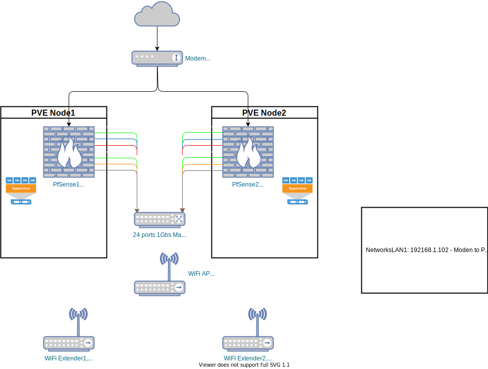

# Network

## VLANS

WAN 192.168.1.0

VLAN1 192.168.2.0 (switch management)

VLAN10 10.0.10.0 (LAN)

VLAN20 10.0.20.0 (PVE Cluster)

VLAN30 10.0.30.0 (CephCluster - Storage)

VLAN40 10.0.40.0 (CephPublic)

VLAN50 10.0.50.0 (VMs)

VLAN60 10.0.60.0 (pfSync)

VLAN70 10.0.70.0 (Gluster Internal - Storage)

VLAN100 10.0.100.0 (Management - IDRACs)

